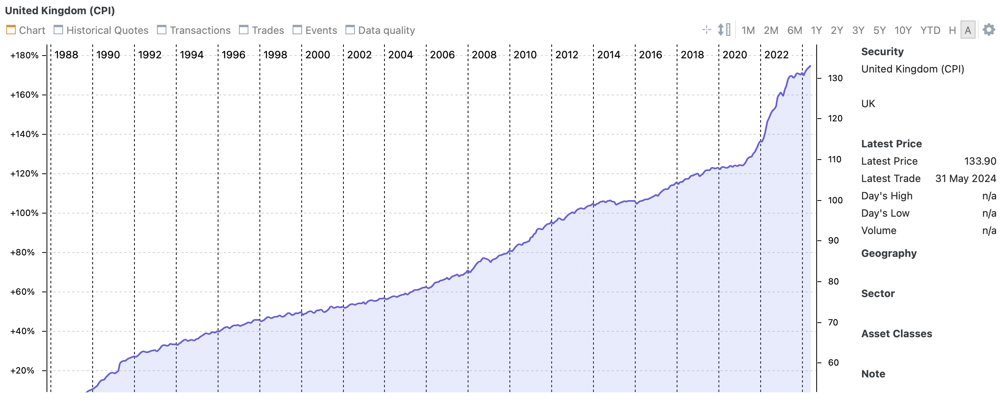

# CPI _with real dates_



A highly sophisticated Python application to grab a time series of UK Consumer Price Index data from the Office For National Statistics website, and then transform them from this...

```json
{
  "months": [
    {
      "date": "1988 JAN",
      "value": "48.4",
      "year": "1988",
      "month": "January",
    },
    {
      "date": "1988 FEB",
      "value": "48.6",
      "year": "1988",
      "month": "February",
    },

    ...
  ]
}
```

...into this:

```json
{
  "cpi": [
    {
      "date": "1988-01-31T00:00:00",
      "value": 48.4
    },
    {
      "date": "1988-02-29T00:00:00",
      "value": 48.6
    }
  ]
}

```

## Ok, but... why?

I use the (excellent) open source application [Portfolio Performance](https://www.portfolio-performance.info/) to track investments. One of its features allows you to measure performance against inflation, but its built-in source for this is the European Central Bank - which dropped the UK from its statistical releases after 2000.

Portfolio Performance also allows you to provide it with a URL that serves this data in JSON format, and allows you to specify how to find the relevant data in a (single) field in the response. However, the date must either conform to [ISO 8601](https://en.wikipedia.org/wiki/ISO_8601) or, if it doesn't, must contain numerals parseable with a pattern like this 'dd.MM.yyyy'. The ONS data doesn't meet either criteria.

## Install

```shell
$ cd ~/ons_cpi_service
$ ./setup.sh
```

If you have `launchctl` in your PATH (i.e. you're running macOS) this will launch the app as a background service

## Uninstall

```shell
$ cd ~/ons_cpi_service
$ ./uninstall.sh
```

## Usage

```shell
curl localhost:5000

{"cpi":[{"date":"1988-01-31T00:00:00","value":48.4},{"date":"1988-02-29T00:00:00","value":48.6},{"date":"1988-03-31T00:00:00","value":48.7},{"date":"1988-04-30T00:00:00","value":49.3},{"date":"1988-05-31T00:00:00","value":49.5},{"date":"1988-06-30T00:00:00","value":49.7},{"date":"1988-07-31T00:00:00","value":49.7},{"date":"1988-08-31T00:00:00","value":49.9},{"date":"1988-09-30T00:00:00","value":50.1},{"date":"1988-10-31T00:00:00","value":50.3},{"date":"1988-11-30T00:00:00","value":50.5},{"date":"1988-12-31T00:00:00","value":50.6} ...
```